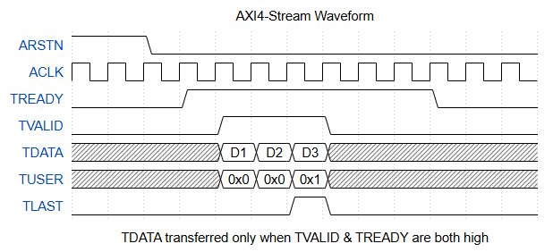
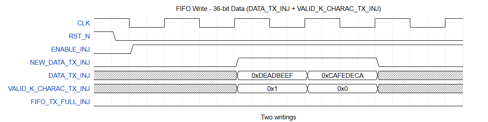
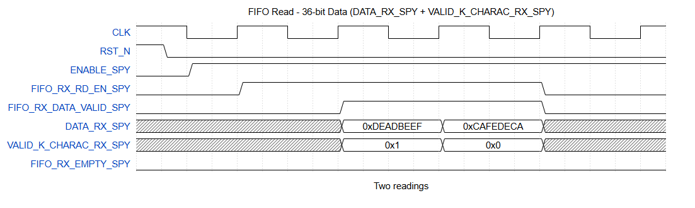
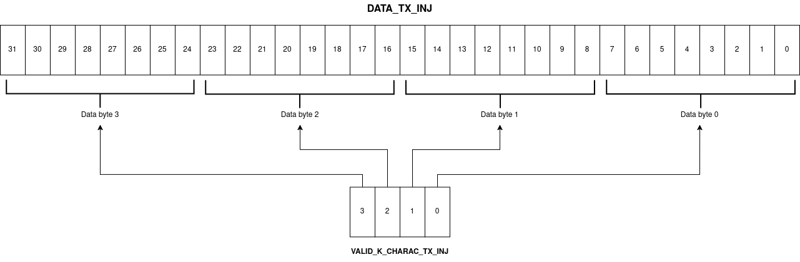
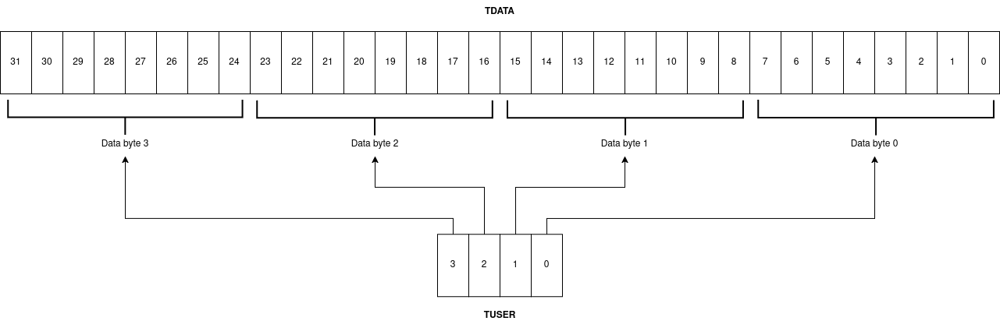
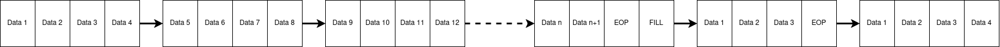

# SpaceFibre Light IP Core

## Introduction

### 1.1 Overview

The SpaceFibre Light IP is compatible with the ECSS-E-ST-50-11C SpaceFibre standard, but do not include all the features.
This IP has been designed to be as technologically independent as possible. 

That's why it contains only two dependent technology IPs:
- HSSL IP from Xilinx
- BufGT for the clock outgoing from this HSSL IP

This IP was developed on a Xilinx VEK 280 with vivado 2024.1

The figure shows the block diagram of the SpaceFibre Light IP.


{ width=800px align=center}


 The SpaceFibre Light IP can be used in several layers:
 -  One access to the Lane layer via Injector and Spy.
 -  One access to the Data Link layer with AXI-Stream buses for each virtual channel.

 The current IP is composed of a configurable 1 to 8 virtual channels and 1 Broadcast channel.

### 1.2 Features

- Up to 8 AXI4-Stream 32b interface data input and outputs from Data Link layer
- AXI4-Stream 32b interface broadcast input and output from Data Link layer
- Custom 32b interface data input and output from Lane layer, activatable
- discrete signals interface for configuration
- Multiple discrete signals for external QoS computing
- Multiple discrete signals for external error management
- 6 Gbit/s output
- Encapsulation and decapsulation of data according to SpaceFiber protocol
- Link management
- Virtual channels physical media access management
- Lane management
- 8b/10b encoding and decoding

## 2 Specification
### 2.1 Clock domains
### 2.1.1 Clock domain: CLK
The first clock domain corresponds to the system clock (150 MHz). The Data-Link layer, Injector and Spy are
synchronized on this clock.
### 2.1.2 Clock domain: CLK_GTY
The second clock domain is the GTY clock. It is the input clock of the Xilinx GTY IP (100
MHz).

### 2.1.3 Clock domain: CLK_TX
The third clock domain is generated by the GTY transceiver IP. The Phy+Lane layer is
synchronized on this clock domain. (150 MHz)

### 2.1.4 Clock domain: AXIS_CLK_TX
The fourth clock domain is the AXI4S clock on the TX flow. (150 MHz)

### 2.1.5 Clock domain: AXIS_CLK_RX
The fifth clock domain is the AXI4S clock on the RX flow. (150 MHz)

### 2.2 Design parameters

Table below shows the IP VHDL generic configurable at IP integration stage.
  
Generics have been added to SpaceFibre Light to set default values on the configuration.
The table below shows the generic: 

| Generic name | Type    | Value | Description               |
| ------------ | ------- | ----- | ------------------------- |
| G_VC_NUM     | integer | 8     | Number of virtual channel |


### 2.3 Ports Description
### 2.3.1 Data path 
### 2.3.1.1 Data Link layer
The SpaceFibre Light I/O signals for the data path at the Data Link layer are described in the table below.

| Port name              | Direction | Type                                  | Description                                                                                                |  Clock domain |
| ---------------------- | --------- | ------------------------------------- | ---------------------------------------------------------------------------------------------------------- | --------------|
| RST_N                  | in        | std_logic                             | global reset                                                                                               | Async         |
| CLK                    | in        | std_logic                             | Main clock                                                                                                 | Clk           |
| AXIS_ARSTN_TX_DL       | in        | std_logic_vector(G_VC_NUM downto 0)   | Active-low asynchronous reset signals for each virtual channel (VC) in the TX path                         | Async         |
| AXIS_ACLK_TX_DL        | in        | std_logic_vector(G_VC_NUM downto 0)   | Clock signals for each VC in the TX path                                                                   | Axis_clk_tx   |
| AXIS_TREADY_TX_DL      | out       | std_logic_vector(G_VC_NUM downto 0)   | Indicates that the data link layer is ready to accept data on each VC                                      | Axis_clk_tx   |
| AXIS_TDATA_TX_DL       | in        | vc_data_array(G_VC_NUM downto 0)      | Data signals from the network layer to the data link layer for each VC                                     | Axis_clk_tx   |
| AXIS_TUSER_TX_DL       | in        | vc_k_array(G_VC_NUM downto 0)         | Sideband information (e.g., control or metadata) from the network layer to the data link layer for each VC | Axis_clk_tx   |
| AXIS_TLAST_TX_DL       | in        | std_logic_vector(G_VC_NUM downto 0)   | Indicates the last transfer in a packet/transaction on each VC                                             | Axis_clk_tx   |
| AXIS_TVALID_TX_DL      | in        | std_logic_vector(G_VC_NUM downto 0)   | Indicates that valid data is available on the TX data bus for each VC                                      | Axis_clk_tx   |
| AXIS_ARSTN_RX_DL       | in        | std_logic_vector(G_VC_NUM downto 0)   | Active-low asynchronous reset signals for each VC in the RX path                                           | Async         |
| AXIS_ACLK_RX_DL        | in        | std_logic_vector(G_VC_NUM downto 0)   | Clock signals for each VC in the RX path                                                                   | Axis_clk_rx   |
| AXIS_TREADY_RX_DL      | in        | std_logic_vector(G_VC_NUM downto 0)   | Indicates that the network layer is ready to receive data on each VC                                       | Axis_clk_rx   |
| AXIS_TDATA_RX_DL       | out       | vc_data_array(G_VC_NUM downto 0)      | Data signals from the data link layer to the network layer for each VC                                     | Axis_clk_rx   |
| AXIS_TUSER_RX_DL       | out       | vc_k_array(G_VC_NUM downto 0)         | Sideband information from the data link layer to the network layer for each VC                             | Axis_clk_rx   |
| AXIS_TLAST_RX_DL       | out       | std_logic_vector(G_VC_NUM downto 0)   | Indicates the last transfer in a packet/transaction on each VC                                             | Axis_clk_rx   |
| AXIS_TVALID_RX_DL      | out       | std_logic_vector(G_VC_NUM downto 0)   | Indicates that valid data is available on the RX data bus for each VC                                      | Clk           |
| CURRENT_TIME_SLOT_NW   | in        | std_logic_vector(7 downto 0)          | Current time slot                                                                                                           

### 2.3.1.2 Phy + Lane layers

The SpaceFibre Light I/O signals for the data path at the Phy plus Lane layers are described in the table below.

| Port name              | Direction | Type                                  | Description                                                     | Clock domain|
| ---------------------- | --------- | ------------------------------------- | --------------------------------------------------------------- |-------------|
| RST_N                  | in        | std_logic                             | global reset                                                    | Async       |
| CLK                    | in        | std_logic                             | Main clock                                                      | Clk         |
| CLK_TX                 | out       | std_logic                             | Clock generated by manufacturer IP                              | Clk_tx      |
| RST_TXCLK_N            | out       | std_logic                             | Reset clock generated by manufacturer IP                        | Clk_tx      |
| CLK_GTY                | in        | std_logic                             | GTY dedicated clock                                             | Clk_gty     |
| TX_POS                 | out       | std_logic                             | Positive LVDS serial data send                                  | /           |
| TX_NEG                 | out       | std_logic                             | Negative LVDS serial data send                                  | /           |
| RX_POS                 | in        | std_logic                             | Positive LVDS serial data received                              | /           |
| RX_NEG                 | in        | std_logic                             | Negative LVDS serial data received                              | /           |
| ENABLE_INJ             | in        | std_logic                             | Enable injector command                                         | Clk         |
| DATA_TX_INJ            | in        | std_logic_vector(31 downto 00)        | Data parallel to be send from injector                          | Clk         |
| CAPABILITY_TX_INJ      | in        | std_logic_vector(07 downto 00)        | Capability send on TX link in INIT3 control word from injector  | Clk         |
| NEW_DATA_TX_INJ        | in        | std_logic                             | Flag to write data in FIFO TX from injetor                      | Clk         |
| VALID_K_CHARAC_TX_INJ  | in        | std_logic_vector(03 downto 00)        | K charachter valid in the 32-bit DATA_TX_INJ vector             | Clk         |
| FIFO_TX_FULL_INJ       | out       | std_logic                             | Flag full of the FIFO TX to the injector                        | Clk         |
| LANE_RESET_INJ         | in        | std_logic                             | Lane Reset command from Injector                                | Clk         |
| ENABLE_SPY             | in        | std_logic                             | Enable Spy read command                                         | Clk         |
| FIFO_RX_RD_EN_SPY      | in        | std_logic                             | FiFo RX read enable flag from the spy                           | Clk         |
| DATA_RX_SPY            | out       | std_logic_vector(31 downto 00)        | 32-bit Data parallel to be received to the spy                  | Clk         |
| FIFO_RX_EMPTY_SPY      | out       | std_logic                             | FiFo RX empty flag to the spy                                   | Clk         |
| FIFO_RX_DATA_VALID_SPY | out       | std_logic                             | FiFo RX data valid flag to the spy                              | Clk         |
| VALID_K_CHARAC_RX_SPY  | out       | std_logic_vector(03 downto 00)        | 4-bit valid K character flags to the spy                        | Clk         |

### 2.3.2 Control path 
### 2.3.2.1 Data Link layer
The SpaceFibre Light I/O signals for the control path at the Data Link level are described in the table below.

| Port name              | Direction | Type                                  | Description                                                                                                                 | Clock domain|
| ---------------------- | --------- | ------------------------------------- | --------------------------------------------------------------------------------------------------------------------------- |-------------|
| RST_N                  | in        | std_logic                             | global reset                                                                                                                | Async       |
| CLK                    | in        | std_logic                             | Main clock                                                                                                                  | Clk         |
| INTERFACE_RESET        | in        | std_logic                             | Reset the link and all configuration register of the Data Link layer                                                        | Clk         |
| LINK_RESET             | in        | std_logic                             | Reset the link                                                                                                              | Clk         |
| NACK_RST_EN            | in        | std_logic                             | Enable automatic Link Reset on NACK reception                                                                               | Clk         |
| NACK_RST_MODE          | in        | std_logic                             | Up for instant Link Reset on NACK reception, down for Link Reset at the end of the current received frame on NACK reception | Clk         |
| PAUSE_VC               | in        | std_logic_vector(8 downto 0)          | Pause the corresponding virtual channel after the end of current transmission                                               | Clk         |
| CONTINUOUS_VC          | in        | std_logic_vector(7 downto 0)          | Enable the corresponding virtual channel continuous mode                                                                    | Clk         |
| SEQ_NUMBER_TX          | out       | std_logic_vector(7 downto 0)          | SEQ_NUMBER in transmission                                                                                                  | Clk         |
| SEQ_NUMBER_RX          | out       | std_logic_vector(7 downto 0)          | SEQ_NUMBER in reception                                                                                                     | Clk         |
| CREDIT_VC              | out       | std_logic_vector(7 downto 0)          | Indicates if each corresponding far-end input buffer has credit                                                             | Clk         |
| INPUT_BUF_OVF_VC       | out       | std_logic_vector(G_VC_NUM-1 downto 0) | Indicates input buffer overflow                                                                                             | Clk         |
| FCT_CREDIT_OVERFLOW    | out       | std_logic_vector(7 downto 0)          | Indicates overflow of each corresponding input buffer                                                                       | Clk         |
| CRC_LONG_ERROR         | out       | std_logic                             | CRC long error                                                                                                              | Clk         |
| CRC_SHORT_ERROR        | out       | std_logic                             | CRC short error                                                                                                             | Clk         |
| FRAME_ERROR            | out       | std_logic                             | Frame error                                                                                                                 | Clk         |
| SEQUENCE_ERROR         | out       | std_logic                             | Sequence error                                                                                                              | Clk         |
| FAR_END_LINK_RESET     | out       | std_logic                             | Far-end Link Reset status                                                                                                   | Clk         |
| FRAME_FINISHED         | out       | std_logic_vector(8 downto 0)          | Indicates that corresponding channel finished emitting a frame                                                              | Clk         |
| FRAME_TX               | out       | std_logic_vector(8 downto 0)          | Indicates that corresponding channel is emitting a frame                                                                    | Clk         |
| DATA_COUNTER_TX        | out       | std_logic_vector(6 downto 0)          | Indicate the number of data transmitted in last frame emitted                                                               | Clk         |
| DATA_COUNTER_RX        | out       | std_logic_vector(6 downto 0)          | Indicate the number of data received in last frame received                                                                 | Clk         |
| ACK_COUNTER_TX         | out       | std_logic_vector(2 downto 0)          | ACK counter TX                                                                                                              | Clk         |
| NACK_COUNTER_TX        | out       | std_logic_vector(2 downto 0)          | NACK counter TX                                                                                                             | Clk         |
| FCT_COUNTER_TX         | out       | std_logic_vector(3 downto 0)          | FCT counter TX                                                                                                              | Clk         |
| ACK_COUNTER_RX         | out       | std_logic_vector(2 downto 0)          | ACK counter RX                                                                                                              | Clk         |
| NACK_COUNTER_RX        | out       | std_logic_vector(2 downto 0)          | NACK counter RX                                                                                                             | Clk         |
| FCT_COUNTER_RX         | out       | std_logic_vector(3 downto 0)          | FCT counter RX                                                                                                              | Clk         |
| FULL_COUNTER_RX        | out       | std_logic_vector(1 downto 0)          | FULL counter RX                                                                                                             | Clk         |
| RETRY_COUNTER_RX       | out       | std_logic_vector(1 downto 0)          | RETRY counter RX                                                                                                            | Clk         |
| CURRENT_TIME_SLOT      | out       | std_logic_vector(7 downto 0)          | Current time slot                                                                                                           | Clk         |
| RESET_PARAM            | out       | std_logic                             | Reset parameters register command                                                                                           | Clk         |
| LINK_RST_ASSERTED      | out       | std_logic                             | Link reset status                                                                                                           | Clk         |
| NACK_SEQ_NUM           | out       | std_logic_vector(7 downto 0)          | NACK Seq_num received                                                                                                       | Clk         |
| ACK_SEQ_NUM            | out       | std_logic_vector(7 downto 0)          | ACK Seq_num received                                                                                                        | Clk         |
| DATA_PULSE_RX          | out       | std_logic                             | Data received pulse signal                                                                                                  | Clk         |
| ACK_PULSE_RX           | out       | std_logic                             | ACK received pulse signal                                                                                                   | Clk         |
| NACK_PULSE_RX          | out       | std_logic                             | NACK received pulse signal                                                                                                  | Clk         |
| FCT_PULSE_RX           | out       | std_logic                             | FCT received pulse signal                                                                                                   | Clk         |
| FULL_PULSE_RX          | out       | std_logic                             | FULL received pulse signal                                                                                                  | Clk         |
| RETRY_PULSE_RX         | out       | std_logic                             | RETRY received pulse signal                                                                                                 | Clk         |

### 2.3.2.2 Phy + Lane layers

The SpaceFibre Light I/O signals for the control path at the Phy plus Lane level are described in the table below.

| Port name              | Direction | Type                                  | Description                                                                    | Clock domain|
| ---------------------- | --------- | ------------------------------------- | -------------------------------------------------------------------------------|-------------|
| CLK_TX                 | out       | std_logic                             | Clock generated by manufacturer IP                                             | Clk_tx      |
| RST_TXCLK_N            | out       | std_logic                             | Reset clock generated by manufacturer IP                                       | Async       |
| LANE_START             | in        | std_logic                             | Asserts or de-asserts LaneStart for the lane                                   | Clk_tx      |
| AUTOSTART              | in        | std_logic                             | Asserts or de-asserts AutoStart for the lane                                   | Clk_tx      |
| LANE_RESET             | in        | std_logic                             | Asserts or de-asserts LaneReset for the lane                                   | Clk_tx      |
| PARALLEL_LOOPBACK_EN   | in        | std_logic                             | Enables or disables the parallel loopback for the lane                         | Clk_tx      |
| STANDBY_REASON         | in        | std_logic_vector(07 downto 00)        | In case of error, pauses communication                                         | Clk_tx      |
| NEAR_END_SERIAL_LB_EN  | in        | std_logic                             | Enables or disables the near-end serial loopback for the lane                  | Clk_tx      |
| FAR_END_SERIAL_LB_EN   | in        | std_logic                             | Enables or disables the far-end serial loopback for the lane                   | Clk_tx      |
| LANE_STATE             | out       | std_logic_vector(03 downto 00)        | Indicates the current state of the Lane Initialization state machine in a lane | Clk_tx      |
| RX_ERROR_CNT           | out       | std_logic_vector(07 downto 00)        | Counter of error detected on the RX link                                       | Clk_tx      |
| RX_ERROR_OVF           | out       | std_logic                             | Overflow flag of the RX_ERROR_CNT                                              | Clk_tx      |
| LOSS_SIGNAL            | out       | std_logic                             | Set when no signal is received on RX link                                      | Clk_tx      |
| FAR_END_CAPA           | out       | std_logic_vector(07 downto 00)        | RX Capabilities field (INT3 flags)                                             | Clk_tx      |
| RX_POLARITY            | out       | std_logic                             | Set when the receiver polarity is inverted                                     | Clk_tx      |

### 2.4 Timing 
The figure shows the block diagram of the SpaceFibre Light IP.

{ width=600px align=center}

- TREADY: Ready signal to the receiver
- TVALID: Validity signal of TDATA, TUSER and TLAST
- TDATA: 32 bits of data
- TLAST: Last word of a packet
- TUSER: 4 bits used to identify K-character (EOP, EEP or Fill) for each byte of a word of TDATA. 

The figure shows two writings with Injector on the Lane layer


{ width=800px align=center}

To use the injector it is necessary to assert "ENABLE_INJ" and realize a classic writing into a FIFO.

The figure shows two readings with Spy on the Lane layer


{ width=800px align=center}

To use the spy it is necessary to assert "ENABLE_SPY" and realize a classic reading into a FIFO.


### 2.5 Performance and Resource Utilization

The utilization and performance of the core are summarized below for a configuration with 8 virtual channels (report after synthesis):

| DSP | FFs  | LUT   | BRAM |
| --- | ---- | ----- | ---- |
| 0   | 4863 | 5123  | 6.5  |


## 3 How to Use

### 3.1 Functional Description

The SpaceFibre Light IP is separated in two layers: the Data Link layer and the Phy + Lane layer.  

The Data Link layer is responsible for the encapsulation and decapsulation fo data and allocate the access to the Physical Medium between 8 virtual channels and a broadcast channel.  
The Phy + Lane layer is responsible for the initialization of the lane through the Physical Medium, the management of the lane, the 8b/10b encoding and decoding of data and the management of the Physical Medium.  
  
Each layer can be used as a data input and output, depending of the configuration of the IP.
  
#### 3.1.1 Lane Layer Interface

During the initialisation procedure (specified in §3.2.3), the discrete signals ENABLE_INJ and ENABLE_SPY must be asserted.  
  
The data are injected and received directly from the Lane layer, bypassing virtual channel management, encapsulation and decapsulation.  

The interface to transmit data through the Physical Medium is the Injector interface, composed of LANE_RESET_INJ, CAPABILTY_TX_INJ, DATA_TX_INJ, NEW_DATA_TX_INJ, VALID_K_CHARAC_TX_INJ and FIFO_TX_FULL_INJ.

DATA_TX_INJ is composed of 32 bits which represent the data to be transmitted next. VALID_K_CHARAC_TX_INJ represents the D/K flags for each byte of DATA_TX_INJ. Each flag is asserted if the corresponding byte of data represents a K character, is de-asserted if it represents a D character. The byte correspondence of VALID_K_CHARAC_TX_INJ is described in the following figure:  

  
  
NEW_DATA_TX_INJ must be asserted when VALID_K_CHARAC_TX_INJ and DATA_TX_INJ are valid, and if FIFO_TX_FULL_INJ is de-asserted. The data is then considered written and the next data can be treated.  
LANE_RESET_INJ is the equivalent of the LaneReset command from the Data Link layer in the Lane layer. It has the same effect as the LANE_RESET signal.  
CAPABILTY_TX_INJ is the value of the Capability byte to be inserted in the INIT3 control word. The value of the bit 1 corresponding to the INIT3LaneStart flag will be overwritten by the Lane layer according to the current configuration.  

The interface to receive data from the Physical Medium is the Spy interface, composed of FIFO_RX_RD_EN_SPY, DATA_RX_SPY, FIFO_RX_DATA_VALID_SPY, VALID_K_CHARAC_RX_SPY and FIFO_RX_EMPTY_SPY.

DATA_RX_SPY is composed of 32 bits which represent the last received data. VALID_K_CHARAC_RX_SPY represents the D/K flags for each byte of DATA_RX_SPY. Each flag is asserted if the corresponding byte of data represents a K character, is de-asserted if it represents a D character. The byte correspondence of VALID_K_CHARAC_RX_SPY is described in the following figure:  

  
  
FIFO_RX_DATA_VALID_SPY must be asserted for VALID_K_CHARAC_RX_SPY and DATA_RX_SPY to be valid. To read a new value, FIFO_RX_RD_EN_SPY must be asserted. The new data to read will be available on the next clock rising edge. FIFO_RX_EMPTY_SPY being asserted indicate that no data are available.  
  
#### 3.1.2 Data Link Layer Interface

During the initialisation procedure (specified in §3.2.3), the discrete signals ENABLE_INJ and ENABLE_SPY must be de-asserted.   

The data are sent and received from the Data Link layer interfaces, which are 32 bits AXI4-Stream interfaces. There are up to 8 Data Virtual Channels and 1 Broadcast Virtual Channel available.  
  
The 4 bits signal TUSER of the AXI4-Stream interfaces is used to transmit the D/K flags for each byte of the word transmitted. It is asserted for K character and de-asserted for D character

  
  
For data format, the packets are ended with an EOP (K29.7) or EEP (K30.7). They can be separated with FILL (K27.7) to maintain data alignment.  
  
  

For broadcast format, the packets have a fixed size of 2 words of 32 bits.  
  
The CURRENT_TIME_SLOT_NW signal is an 8 bit value representing the current time-slot for the QoS. This signal might be used only if QoS is computed externally.  
  
The CONTINUOUS_VC is used to activate the continuous mode on the different data virtual channels TX. When activated, the data can always be written to the virtual channel, but if the output buffer overflows, it is flushed and an EEP (K30.7) is inserted. Then the next data are discarded until an EOP or EEP is sent, indicating the start of a new packet. This mode is used when receiving the most recent data is more important than missing one.  
  

#### 3.1.3 QoS discrete Signal Interface

The QoS discrete signal interface is composed of multiple status to allow an external computing of channel priority:
- FRAME_FINISHED
- FRAME_TX
- DATA_COUNTER_TX
- DATA_COUNTER_RX
- ACK_COUNTER_TX
- ACK_COUNTER_RX
- NACK_COUNTER_TX
- NACK_COUNTER_RX
- FCT_COUNTER_TX
- FCT_COUNTER_RX
- FULL_COUNTER_RX
- RETRY_COUNTER_RX
- DATA_PULSE_RX
- ACK_PULSE_RX
- NACK_PULSE_RX
- FCT_PULSE_RX
- FULL_PULSE_RX
- RETRY_PULSE_RX
- CURRENT_TIME_SLOT

The counters are incremented and the pulses are asserted when the corresponding type of word is received or transmitted.  
  
The PAUSE_VC 9 bits are then used to pause the corresponding channel, including the broadcast channel. By piloting PAUSE_VC, it is then possible to apply the priority which as being computed externally.


#### 3.1.4 Error Management discrete Signal Interface

The Error Management discrete signal interface is composed of multiple status to allow external error diagnostic and error management:  
- SEQ_NUMBER_TX
- SEQ_NUMBER_RX
- CREDIT_VC
- INPUT_BUF_OVF_VC
- FCT_CREDIT_OVERFLOW
- CRC_LONG_ERROR
- CRC_SHORT_ERROR
- SEQUENCE_ERROR
- FRAME_ERROR
- NACK_SEQ_NUM
- ACK_SEQ_NUM

Depending on the implementation of external error management, multiple strategies are available on reception of a NACK control word.  
When NACK_RST_EN is de-asserted, nothing is done on NACK reception, as it is supposed to be managed externally. When asserted, a Link Reset procedure is required automatically for NACK reception. This Link Reset procedure is delayed until the end of the current packet being received if NACK_RST_MODE is de-asserted. 

### 3.2 IP Integration
#### 3.2.1 Clocking and reset

There are 20 clocks to provide to the SpaceFibre Light IP. There are 2 clocks needed for the different layers of the IP, and 18 clocks to be provided for the 9 AXI4-Stream Master interfaces and 9 AXI4-Stream Slave interfaces:  

- CLK: This clock is associated with the first clock domain and corresponds to the system clock. It must be at 150 MHz. The Data-Link layer discrete signals, the Lane layer Injector interface and the Lane layer Spy interface are synchronized with this clock.
- CLK_GTY: This clock is the input clock of the Xilinx GTY IP and must be at 100 MHz.
- AXIS_ACLK_TX_DL : This vector is composed of the 9 AXI4-Stream Master clocks. Each interface AXI4-Stream of the TX interface is synchronized with its corresponding clock, which must be provided with a frequency of 150 MHz.
- AXIS_ACLK_RX_DL : This vector is composed of the 9 AXI4-Stream Slave clocks. Each interface AXI4-Stream of the RX interface is synchronized with its corresponding clock, which must be provided with a frequency of 150 MHz.

To generate the CLK_GTY clock, a reference clock must be used through the Gigabit Transceiver Buffer IBUFDS_GTE5 primitive.  
  

**Generics of `IBUFDS_GTE5_I`**

| Name                | Value | 
|---------------------|-------|
| REFCLK_EN_TX_PATH   | '0'   |
| REFCLK_ICNTL_RX     | 0     |
| REFCLK_HROW_CK_SEL  | 0     |
  
   

**Ports of `IBUFDS_GTE5_I`**

| Name | Connected to            | Note                                 |
|------|--------------------------|--------------------------------------|
| O    | CLK_GTY                  | Output                               |
| I    | QUAD0_GTREFCLK0_in_p    | Differential input (positive)        |
| IB   | QUAD0_GTREFCLK0_in_n    | Differential input (negative)        |
| CEB  | '0'                     | Clock buffer enable (active low)     |


One clock is provided by the SpaceFibre Light IP:
  
- CLK_TX: This clock is generated by the GTY transceiver IP at 150 MHz. The Phy layer and Lane layer discrete signals are synchronized with this clock. 
  
Different reset signals are available on the SpaceFibre Light IP:  
  
- RST_N: Main reset signal, active-low and asynchronous. A pulse is needed to activate the reset of the GTY IP.
- LANE_RESET: Reset signal of the Phy and Lane layers, synchronized with CLK_TX, active high. This signal activates the lane reset procedure.
- LANE_RESET_INJ: Reset signal of the Phy and Lane layers, synchronized with CLK, active high. This signal activates the lane reset procedure. This signal is dependant of the ENABLE_INJ signal.
- LINK_RESET: Reset signal of the Phy, Lane and Data Link layers, synchronized with CLK, active high. This signal activates the Link Reset procedure and the lane reset procedure.
- INTERFACE_RESET: Reset signal of the Phy, Lane and Data Link layers, synchronized with CLK, active high. This signal activates the Link Reset procedure and the lane reset procedure and assert the RESET_PARAM signal.
- AXIS_ARSTN_TX_DL : This vector is composed of the 9 AXI4-Stream Master reset signals. Each interface AXI4-Stream of the TX interface is reset by its corresponding reset signals, which is active low and asynchronous.
- AXIS_ARSTN_RX_DL : This vector is composed of the 9 AXI4-Stream Slave reset signals. Each interface AXI4-Stream of the RX interface is reset by its corresponding reset signals, which is active low and asynchronous.

Some output signals are provided by the SpaceFibre Light IP to control external signals:
- RST_TXCLK_N: Reset synchronous with CLK_TX, active low. This signal is an output of the IP and is active when a reset of the Phy and Lane layers is required. It is maintained active until the Phy layer reset is completed.
- RESET_PARAM: Reset synchronous with CLK, active high. This signal is an output of the IP and is active when a reset of the configuration signals of the SPACEFIBRE IP is required. 

#### 3.2.2 Constraints

This paragraph includes the constraints to be set by the end-user for the IP the be properly integrated in the final design.
To implement the SpaceFibre Light IP, you have to select the right GTY ports. To do so, follow the procedure below:
- Run Synthesis
- Do "Open Synthesized Design"
- In "Hard Block Planner", Select "Populate"
- Select the "Site" used 
- Select the REFCLK "Source" (bank and pin)
- Save it
- Choose where do you want to add the constraints (which file .xdc)

Note : REFCLK corresponds to CLK_GTY and is configured at 100 MHz in the IP.


#### 3.2.3 Programming sequence

To use the SpaceFibre Light IP, different procedures must be followed. Those  procedures are described below:  
  
*Power up procedure*  

- Wait until RST_TXCLK_N is de-asserted
- Assert and de-assert RST_N
- Wait until RST_TXCLK_N is de-asserted
  
  
*Initialisation procedure*  

- Set your configuration on parameters discrete signals of Data Link layer
- Set your configuration on parameters discrete signals of Phy layer
- Set your configuration on parameters discrete signals of Lane layer
- Assert LinkReset
- Wait until RST_TXCLK_N is de-asserted
- Set either AutoStart or LaneStart, depending on the need
- Wait until LaneState reach ACTIVE ('0111')
  
*Usage from Data Link layer*
- Write data in the different virtual channels through the AXI4-Stream Master interfaces
- Read data in the different virtual channels through the AXI4-Stream Slave interfaces

*Usage from Lane layer*
- Write data on the lane through the Lane Injector interface
- Read data on the lane through the Lane Spy interface

#### 3.2.4 VHDL

Except for the Xilinx/AMD sources, all source files can be compiled using the VHDL-93 or VHDL-2008 language version.  
  
The Xilinx/AMD VHDL sources can be compiled using the VHDL-93 or VHDL-2008 language version, the Xilinx/AMD Verilog sources can be compiled using the Verilog 2005 language version and the Xilinx/AMD SystemVerilog sources can be compiled using the SystemVerilog language version.

## 4 Notes


### 4.1 Main directory overview  

The main directories of the SpaceFibre Light IP project are :  
  
- [`01_design`](27-9771ED_CNES_IP-SPACE-FIBRE/IP_SPACE_FIBRE/02_dev/01_design) - source files of the SpaceFibre Light IP
- [`02_implementation`](27-9771ED_CNES_IP-SPACE-FIBRE/IP_SPACE_FIBRE/02_dev/02_implementation) - implementation files of the SpaceFibre Light IP
- [`03_verification`](27-9771ED_CNES_IP-SPACE-FIBRE/IP_SPACE_FIBRE/02_dev/03_verification) - verification source files and virtual test scripts
- [`04_validation`](27-9771ED_CNES_IP-SPACE-FIBRE/IP_SPACE_FIBRE/02_dev/04_validation) - physical test scripts  

The overall SpaceFibre Light IP project architecture is as follows:

```
27-9771ED_CNES_IP-SPACE-FIBRE
└── IP_SPACE_FIBRE
    ├── 01_doc
    └── 02_dev
        ├── 01_design
        │   ├── 01_cores                        # Manufacturer IP sources
        │   │   ├──BufG_GT_bd
        │   │   └──extended_phy_layer
        │   ├── 02_external_ip                  # External IP sources
        │   │   ├── fifo_dc
        │   │   ├── fifo_dc_axis_to_custom
        │   │   ├── fifo_dc_custom_to_axis
        │   │   └── fifo_dc_drop_bad_frame
        │   ├── 03_sources                      # SpaceFibre Light IP sources
        │   │   ├── ip_spacefibre_light_top
        │   │   ├── module_data_link
        │   │   └── module_phy_plus_lane
        │   ├── 04_packages                     # SpaceFibre Light IP packages
        │   └── 05_libraries                    # SpaceFibre Light IP libraries
        ├── 02_implementation
        ├── 03_verification
        │   ├── 01_models                       # Verification models
        │   │   ├── data_link                   # Data Link RTL models
        │   │   │   ├── data_link_analyzer
        │   │   │   ├── data_link_configurator
        │   │   │   └── data_link_generator
        │   │   ├── lane                        # Lane RTL models
        │   │   │   ├── lane_analyzer
        │   │   │   ├── lane_configurator
        │   │   │   └── lane_generator
        │   │   └── python_model                # Python model
        │   │       └── python_model_data_link  # Python Data Link specific model
        │   ├── 02_benches                      # Verification benches 
        │   │   ├── common                      # Python base bench
        │   │   ├── configuration_1_bench       # Legacy configuration
        │   │   └── configuration_2_bench       # RTL and Python benches
        │   ├── 03_packages                     # Verification RTL packages
        │   ├── 04_libraries                    # Verification RTL libraries
        │   └── 05_scenario                     # Virtual verification test scenario
        │       ├── archive
        │       │   └── configuration_1_bench
        │       ├── covhtmlreport               # Merged code coverage of virtual verification
        │       ├── data_link_link_reset
        │       ├── data_link_reception
        │       ├── data_link_transmission
        │       ├── lane_loopback
        │       ├── lane_status_and_parameters_access
        │       ├── lane_loopback_farend
        │       ├── lane_receiver
        │       └── lane_transmitter
        └── 04_validation                       # Physical validation test scenario
            └── 01_scenario
                ├── data_link_link_reset
                ├── data_link_loopback
                └── lane_loopback
        
```

### 4.3 Improvments
None 

### 4.4 Known issues


#### 4.4.1 ACK/NACK Error management issue with Data Link polarity flag TX

ACK and NACK transmitted allow to acknowledge the good or bad reception of a frame. The corresponding frame is identified thanks to a sequence_number on 7 bits and a polarity flag. The value of those signals are computed by the Data Link during transmission and added to the encapsulation of the frame.
ACK and NACK are considered valid and to be acknowledged when the polarity flag they are associated with is of the same value of the one in the current transmission chain. If they are not valid, they are simply discarded.  
  
The polarity flag of the transmission chain changes its value when and only when an error recovery operation is started. But this functionality is not implemented in the SpaceFibre Light IP as it is supposed to be implemented externally. Thus, an error recovery operation cannot be started, and the polarity flag is stuck in its initial value, which is positive.  
This leads to a functional problem: if a NACK is received when the NACK_RST_EN is de-asserted, then the communication is blocked as an error recovery operation is expected by the far-end system but cannot be performed by the near-end system. An external control of the sequence_number and the of the polarity flag in transmission would be required to overcome this issue.  
Because of this limitation, the behaviour of the SpaceFibre Light IP couldn't be tested with a valid negative polarity flag in an ACK or a NACK being received, the context required for them to be considered valid being impossible to reach.  
  
  
#### 4.4.2 Delayed Link Reset procedure on NACK reception unsupported

The functionality of the NACK_RST_EN and NACK_RST_MODE signals is to provide the following scenarios :

| NACK_RST_EN | NACK_RST_MODE  | Description                           |
|-------------|----------------|---------------------------------------|
| 0           | 0              | No action in case of NACK reception   |
| 0           | 1              | No action in case of NACK reception   |
| 1           | 0              | Link Reset after NACK reception       |
| 1           | 1              | After NACK reception, wait to empty input buffers  then Link Reset |

The IP does not currently support the scenario where NACK_RST_MODE and NACK_RST_EN are both asserted. If NACK_RST_EN is asserted, a Link Reset is performed as soon as a NACK is received. Otherwise, the reception of a NACK does not require any particular procedure.
The current status is as follows:

| NACK_RST_EN | NACK_RST_MODE  | Description                           |
|-------------|----------------|---------------------------------------|
| 0           | 0              | No action in case of NACK reception   |
| 0           | 1              | No action in case of NACK reception   |
| 1           | 0              | Link Reset after NACK reception       |
| 1           | 1              | Link Reset after NACK reception       |

#### 4.4.3 Possible Robustness Issue

When running several physical tests in a row on the DATALINK layer, some tests initially considered PASS might end up being FAIL. This doesn't prevent from running conclusive (PASS) tests afterwards, even the one who ended up being FAIL.
This error can be caused by a number of factors:
- Software mismanagement
- Errors in RTL generator and analyzer models
- Error coming from the IP itself

### 4.5 License
This IP is copyright CNES and can be licensed to be use in external projects. 
