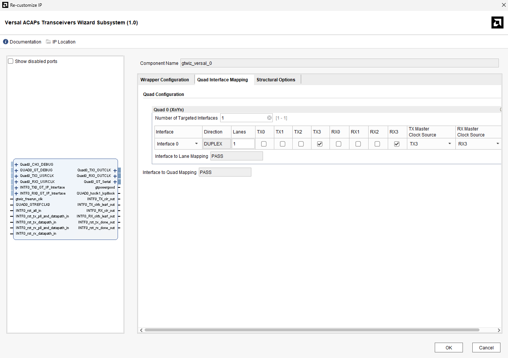
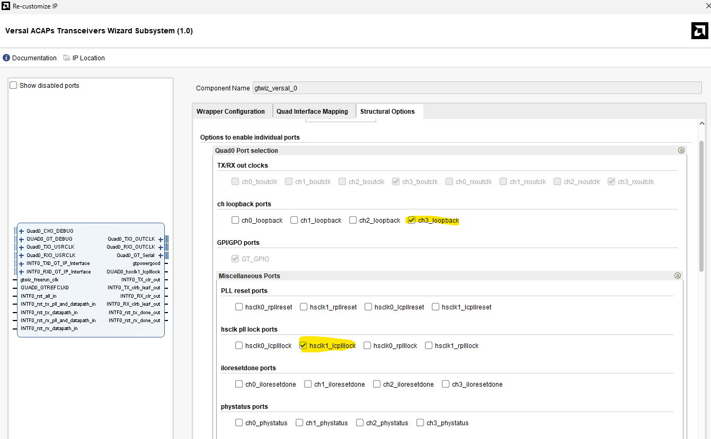

This README explains how to change the channel without changing the quad for the GTY IP from Xilinx in the context of the SpaceFibre Light project

First, in the IP configuration itself, in the 'Quad Interface Mapping' section, you need to change the channels from 0 to 3 as well as the clock sources, as shown in the following image:


Next, in the 'Structural Options' section, you need to change ch0_loopback and hsclk0_lcplllock.


In phy_plus_lane.vhd, the changes in the instantiation are:
```
  QUAD0_RX3_outclk_0                   => open,
  QUAD0_RX3_usrclk_0                   => clk_tx,--QUAD0_TX0_outclk,
  QUAD0_TX3_outclk_0                   => QUAD0_TX0_outclk,
  QUAD0_TX3_usrclk_0                   => clk_tx, --QUAD0_TX0_outclk,
  QUAD0_hsclk1_lcplllock_0             => QUAD0_hsclk1_lcplllock,
  Quad0_CH3_DEBUG_0_ch_loopback        => QUAD0_ch3_loopback,
```
In the code:
```
  QUAD0_rxp(3)               <= RX_POS;
  QUAD0_rxn(3)               <= RX_NEG;
  TX_POS                     <= QUAD0_txp(3);
  TX_NEG                     <= QUAD0_txn(3);
```