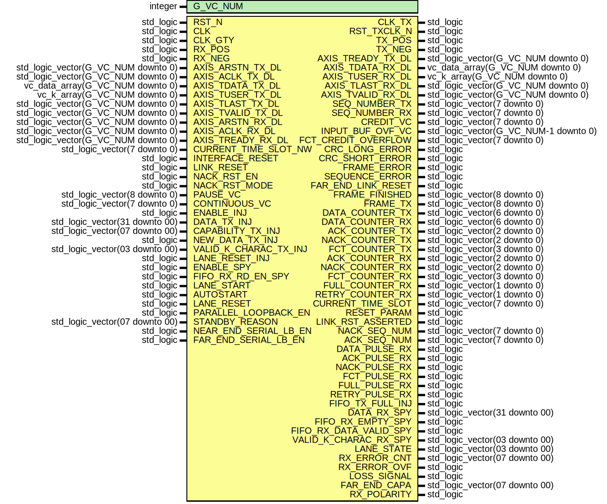

# Entity: spacefibre_light_top 
- **File**: spacefibre_light_top.vhd

## Diagram

## Generics

| Generic name | Type    | Value | Description               |
| ------------ | ------- | ----- | ------------------------- |
| G_VC_NUM     | integer | 8     | Number of virtual channel |

## Ports

| Port name              | Direction | Type                                  | Description                                                                                                                 |
| ---------------------- | --------- | ------------------------------------- | --------------------------------------------------------------------------------------------------------------------------- |
| RST_N                  | in        | std_logic                             | global reset                                                                                                                |
| CLK                    | in        | std_logic                             | Main clock                                                                                                                  |
| CLK_TX                 | out       | std_logic                             | Clock generated by manufacturer IP                                                                                          |
| RST_TXCLK_N            | out       | std_logic                             | Reset clock generated by manufacturer IP                                                                                    |
| CLK_GTY                | in        | std_logic                             | GTY dedicated clock                                                                                                         |
| TX_POS                 | out       | std_logic                             | Positive LVDS serial data send                                                                                              |
| TX_NEG                 | out       | std_logic                             | Negative LVDS serial data send                                                                                              |
| RX_POS                 | in        | std_logic                             | Positive LVDS serial data received                                                                                          |
| RX_NEG                 | in        | std_logic                             | Negative LVDS serial data received                                                                                          |
| AXIS_ARSTN_TX_DL       | in        | std_logic_vector(G_VC_NUM downto 0)   | Active-low asynchronous reset signals for each virtual channel (VC) in the TX path                                          |
| AXIS_ACLK_TX_DL        | in        | std_logic_vector(G_VC_NUM downto 0)   | Clock signals for each VC in the TX path                                                                                    |
| AXIS_TREADY_TX_DL      | out       | std_logic_vector(G_VC_NUM downto 0)   | Indicates that the data link layer is ready to accept data on each VC                                                       |
| AXIS_TDATA_TX_DL       | in        | vc_data_array(G_VC_NUM downto 0)      | Data signals from the network layer to the data link layer for each VC                                                      |
| AXIS_TUSER_TX_DL       | in        | vc_k_array(G_VC_NUM downto 0)         | Sideband information (e.g., control or metadata) from the network layer to the data link layer for each VC                  |
| AXIS_TLAST_TX_DL       | in        | std_logic_vector(G_VC_NUM downto 0)   | Indicates the last transfer in a packet/transaction on each VC                                                              |
| AXIS_TVALID_TX_DL      | in        | std_logic_vector(G_VC_NUM downto 0)   | Indicates that valid data is available on the TX data bus for each VC                                                       |
| AXIS_ARSTN_RX_DL       | in        | std_logic_vector(G_VC_NUM downto 0)   | Active-low asynchronous reset signals for each VC in the RX path                                                            |
| AXIS_ACLK_RX_DL        | in        | std_logic_vector(G_VC_NUM downto 0)   | Clock signals for each VC in the RX path                                                                                    |
| AXIS_TREADY_RX_DL      | in        | std_logic_vector(G_VC_NUM downto 0)   | Indicates that the network layer is ready to receive data on each VC                                                        |
| AXIS_TDATA_RX_DL       | out       | vc_data_array(G_VC_NUM downto 0)      | Data signals from the data link layer to the network layer for each VC                                                      |
| AXIS_TUSER_RX_DL       | out       | vc_k_array(G_VC_NUM downto 0)         | Sideband information from the data link layer to the network layer for each VC                                              |
| AXIS_TLAST_RX_DL       | out       | std_logic_vector(G_VC_NUM downto 0)   | Indicates the last transfer in a packet/transaction on each VC                                                              |
| AXIS_TVALID_RX_DL      | out       | std_logic_vector(G_VC_NUM downto 0)   | Indicates that valid data is available on the RX data bus for each VC                                                       |
| CURRENT_TIME_SLOT_NW   | in        | std_logic_vector(7 downto 0)          | Current time slot                                                                                                           |
| INTERFACE_RESET        | in        | std_logic                             | Reset the link and all configuration register of the Data Link layer                                                        |
| LINK_RESET             | in        | std_logic                             | Reset the link                                                                                                              |
| NACK_RST_EN            | in        | std_logic                             | Enable automatic link reset on NACK reception                                                                               |
| NACK_RST_MODE          | in        | std_logic                             | Up for instant link reset on NACK reception, down for link reset at the end of the current received frame on NACK reception |
| PAUSE_VC               | in        | std_logic_vector(8 downto 0)          | Pause the corresponding virtual channel after the end of current transmission                                               |
| CONTINUOUS_VC          | in        | std_logic_vector(7 downto 0)          | Enable the corresponding virtual channel continuous mode                                                                    |
| SEQ_NUMBER_TX          | out       | std_logic_vector(7 downto 0)          | SEQ_NUMBER in transmission                                                                                                  |
| SEQ_NUMBER_RX          | out       | std_logic_vector(7 downto 0)          | SEQ_NUMBER in reception                                                                                                     |
| CREDIT_VC              | out       | std_logic_vector(7 downto 0)          | Indicates if each corresponding far-end input buffer has credit                                                             |
| INPUT_BUF_OVF_VC       | out       | std_logic_vector(G_VC_NUM-1 downto 0) | Indicates input buffer overflow                                                                                             |
| FCT_CREDIT_OVERFLOW    | out       | std_logic_vector(7 downto 0)          | Indicates overflow of each corresponding input buffer                                                                       |
| CRC_LONG_ERROR         | out       | std_logic                             | CRC long error                                                                                                              |
| CRC_SHORT_ERROR        | out       | std_logic                             | CRC short error                                                                                                             |
| FRAME_ERROR            | out       | std_logic                             | Frame error                                                                                                                 |
| SEQUENCE_ERROR         | out       | std_logic                             | Sequence error                                                                                                              |
| FAR_END_LINK_RESET     | out       | std_logic                             | Far-end link reset status                                                                                                   |
| FRAME_FINISHED         | out       | std_logic_vector(8 downto 0)          | Indicates that corresponding channel finished emitting a frame                                                              |
| FRAME_TX               | out       | std_logic_vector(8 downto 0)          | Indicates that corresponding channel is emitting a frame                                                                    |
| DATA_COUNTER_TX        | out       | std_logic_vector(6 downto 0)          | Indicate the number of data transmitted in last frame emitted                                                               |
| DATA_COUNTER_RX        | out       | std_logic_vector(6 downto 0)          | Indicate the number of data received in last frame received                                                                 |
| ACK_COUNTER_TX         | out       | std_logic_vector(2 downto 0)          | ACK counter TX                                                                                                              |
| NACK_COUNTER_TX        | out       | std_logic_vector(2 downto 0)          | NACK counter TX                                                                                                             |
| FCT_COUNTER_TX         | out       | std_logic_vector(3 downto 0)          | FCT counter TX                                                                                                              |
| ACK_COUNTER_RX         | out       | std_logic_vector(2 downto 0)          | ACK counter RX                                                                                                              |
| NACK_COUNTER_RX        | out       | std_logic_vector(2 downto 0)          | NACK counter RX                                                                                                             |
| FCT_COUNTER_RX         | out       | std_logic_vector(3 downto 0)          | FCT counter RX                                                                                                              |
| FULL_COUNTER_RX        | out       | std_logic_vector(1 downto 0)          | FULL counter RX                                                                                                             |
| RETRY_COUNTER_RX       | out       | std_logic_vector(1 downto 0)          | RETRY counter RX                                                                                                            |
| CURRENT_TIME_SLOT      | out       | std_logic_vector(7 downto 0)          | Current time slot                                                                                                           |
| RESET_PARAM            | out       | std_logic                             | Reset parameters register command                                                                                           |
| LINK_RST_ASSERTED      | out       | std_logic                             | Link reset status                                                                                                           |
| NACK_SEQ_NUM           | out       | std_logic_vector(7 downto 0)          | NACK Seq_num received                                                                                                       |
| ACK_SEQ_NUM            | out       | std_logic_vector(7 downto 0)          | ACK Seq_num received                                                                                                        |
| DATA_PULSE_RX          | out       | std_logic                             | Data received pulse signal                                                                                                  |
| ACK_PULSE_RX           | out       | std_logic                             | ACK received pulse signal                                                                                                   |
| NACK_PULSE_RX          | out       | std_logic                             | NACK received pulse signal                                                                                                  |
| FCT_PULSE_RX           | out       | std_logic                             | FCT received pulse signal                                                                                                   |
| FULL_PULSE_RX          | out       | std_logic                             | FULL received pulse signal                                                                                                  |
| RETRY_PULSE_RX         | out       | std_logic                             | RETRY received pulse signal                                                                                                 |
| ENABLE_INJ             | in        | std_logic                             | Enable injector command                                                                                                     |
| DATA_TX_INJ            | in        | std_logic_vector(31 downto 00)        | Data parallel to be send from injector                                                                                      |
| CAPABILITY_TX_INJ      | in        | std_logic_vector(07 downto 00)        | Capability send on TX link in INIT3 control word from injector                                                              |
| NEW_DATA_TX_INJ        | in        | std_logic                             | Flag to write data in FIFO TX from injetor                                                                                  |
| VALID_K_CHARAC_TX_INJ  | in        | std_logic_vector(03 downto 00)        | K charachter valid in the 32-bit DATA_TX_INJ vector                                                                         |
| FIFO_TX_FULL_INJ       | out       | std_logic                             | Flag full of the FIFO TX to the injector                                                                                    |
| LANE_RESET_INJ         | in        | std_logic                             | Lane Reset command from Injector                                                                                            |
| ENABLE_SPY             | in        | std_logic                             | Enable Spy read command                                                                                                     |
| FIFO_RX_RD_EN_SPY      | in        | std_logic                             | FiFo RX read enable flag from the spy                                                                                       |
| DATA_RX_SPY            | out       | std_logic_vector(31 downto 00)        | 32-bit Data parallel to be received to the spy                                                                              |
| FIFO_RX_EMPTY_SPY      | out       | std_logic                             | FiFo RX empty flag to the spy                                                                                               |
| FIFO_RX_DATA_VALID_SPY | out       | std_logic                             | FiFo RX data valid flag to the spy                                                                                          |
| VALID_K_CHARAC_RX_SPY  | out       | std_logic_vector(03 downto 00)        | 4-bit valid K character flags to the spy                                                                                    |
| LANE_START             | in        | std_logic                             | Asserts or de-asserts LaneStart for the lane                                                                                |
| AUTOSTART              | in        | std_logic                             | Asserts or de-asserts AutoStart for the lane                                                                                |
| LANE_RESET             | in        | std_logic                             | Asserts or de-asserts LaneReset for the lane                                                                                |
| PARALLEL_LOOPBACK_EN   | in        | std_logic                             | Enables or disables the parallel loopback for the lane                                                                      |
| STANDBY_REASON         | in        | std_logic_vector(07 downto 00)        | In case of error, pauses communication                                                                                      |
| NEAR_END_SERIAL_LB_EN  | in        | std_logic                             | Enables or disables the near-end serial loopback for the lane                                                               |
| FAR_END_SERIAL_LB_EN   | in        | std_logic                             | Enables or disables the far-end serial loopback for the lane                                                                |
| LANE_STATE             | out       | std_logic_vector(03 downto 00)        | Indicates the current state of the Lane Initialization state machine in a lane                                              |
| RX_ERROR_CNT           | out       | std_logic_vector(07 downto 00)        | Counter of error detected on the RX link                                                                                    |
| RX_ERROR_OVF           | out       | std_logic                             | Overflow flag of the RX_ERROR_CNT                                                                                           |
| LOSS_SIGNAL            | out       | std_logic                             | Set when no signal is received on RX link                                                                                   |
| FAR_END_CAPA           | out       | std_logic_vector(07 downto 00)        | RX Capabilities field (INT3 flags)                                                                                          |
| RX_POLARITY            | out       | std_logic                             | Set when the receiver polarity is inverted                                                                                  |

## Signals

| Name                      | Type                                  | Description                                                          |
| ------------------------- | ------------------------------------- | -------------------------------------------------------------------- |
| rst_sync_gty_n            | std_logic                             | Synchronous reset on clock generated by GTY PLL                      |
| clk_tx_i                  | std_logic                             | Clock generated by PLL of the manufacturer IP                        |
| rst_tx_done               | std_logic                             | Up when internal rx reset done                                       |
| lane_reset_ppl_out        | std_logic                             |                                                                      |
| data_tx_dl                | std_logic_vector(31 downto 0)         |                                                                      |
| capability_tx_dl          | std_logic_vector(7 downto 0)          |                                                                      |
| new_data_tx_dl            | std_logic                             |                                                                      |
| valid_k_charac_tx_dl      | std_logic_vector(3 downto 0)          |                                                                      |
| fifo_tx_full_mux          | std_logic                             |                                                                      |
| fifo_rx_rd_en_dl          | std_logic                             |                                                                      |
| data_rx_ppl               | std_logic_vector(31 downto 0)         |                                                                      |
| fifo_rx_empty_ppl         | std_logic                             |                                                                      |
| fifo_rx_data_valid_ppl    | std_logic                             |                                                                      |
| valid_k_charac_rx_ppl     | std_logic_vector(3 downto 0)          |                                                                      |
| far_end_capa_ppl          | std_logic_vector(7 downto 0)          |                                                                      |
| far_end_capa_dl_ppl       | std_logic_vector(7 downto 0)          |                                                                      |
| lane_active_ppl           | std_logic                             |                                                                      |
| lane_reset_dl             | std_logic                             |                                                                      |
| lane_start_ppl            | std_logic                             | Parameter signal between MIB_phy_plus_lane and phy_plus_lane modules |
| autostart_ppl             | std_logic                             | Parameter signal between MIB_phy_plus_lane and phy_plus_lane modules |
| lane_reset_ppl            | std_logic                             | Parameter signal between MIB_phy_plus_lane and phy_plus_lane modules |
| parallel_loopback_en_ppl  | std_logic                             | Parameter signal between MIB_phy_plus_lane and phy_plus_lane modules |
| standby_reason_ppl        | std_logic_vector(07 downto 00)        | Parameter signal between MIB_phy_plus_lane and phy_plus_lane modules |
| near_end_serial_lb_en_ppl | std_logic                             | Parameter signal between MIB_phy_plus_lane and phy_plus_lane modules |
| far_end_serial_lb_en_ppl  | std_logic                             | Parameter signal between MIB_phy_plus_lane and phy_plus_lane modules |
| lane_state_ppl            | std_logic_vector(03 downto 00)        | Status signal between MIB_phy_plus_lane and phy_plus_lane modules    |
| rx_error_cnt_ppl          | std_logic_vector(07 downto 00)        | Status signal between MIB_phy_plus_lane and phy_plus_lane modules    |
| rx_error_ovf_ppl          | std_logic                             | Status signal between MIB_phy_plus_lane and phy_plus_lane modules    |
| loss_signal_ppl           | std_logic                             | Status signal between MIB_phy_plus_lane and phy_plus_lane modules    |
| rx_polarity_ppl           | std_logic                             | Status signal between MIB_phy_plus_lane and phy_plus_lane modules    |
| interface_reset_dl        | std_logic                             |                                                                      |
| link_reset_dl             | std_logic                             |                                                                      |
| nack_rst_en_dl            | std_logic                             |                                                                      |
| nack_rst_mode_dl          | std_logic                             |                                                                      |
| pause_vc_dl               | std_logic_vector(G_VC_NUM downto 0)   |                                                                      |
| continuous_vc_dl          | std_logic_vector(G_VC_NUM-1 downto 0) |                                                                      |
| seq_number_tx_dl          | std_logic_vector(G_VC_NUM-1 downto 0) |                                                                      |
| seq_number_rx_dl          | std_logic_vector(G_VC_NUM-1 downto 0) |                                                                      |
| credit_vc_dl              | std_logic_vector(G_VC_NUM-1 downto 0) |                                                                      |
| input_buf_ovf_vc_dl       | std_logic_vector(G_VC_NUM-1 downto 0) |                                                                      |
| fct_credit_overflow_dl    | std_logic_vector(G_VC_NUM-1 downto 0) |                                                                      |
| crc_long_error_dl         | std_logic                             |                                                                      |
| crc_short_error_dl        | std_logic                             |                                                                      |
| frame_error_dl            | std_logic                             |                                                                      |
| sequence_error_dl         | std_logic                             |                                                                      |
| far_end_link_reset_dl     | std_logic                             |                                                                      |
| frame_finished_dl         | std_logic_vector(G_VC_NUM downto 0)   |                                                                      |
| frame_tx_dl               | std_logic_vector(G_VC_NUM downto 0)   |                                                                      |
| data_counter_tx_dl        | std_logic_vector(6 downto 0)          |                                                                      |
| data_counter_rx_dl        | std_logic_vector(6 downto 0)          |                                                                      |
| ack_counter_tx_dl         | std_logic_vector(2 downto 0)          |                                                                      |
| nack_counter_tx_dl        | std_logic_vector(2 downto 0)          |                                                                      |
| fct_counter_tx_dl         | std_logic_vector(3 downto 0)          |                                                                      |
| ack_counter_rx_dl         | std_logic_vector(2 downto 0)          |                                                                      |
| nack_counter_rx_dl        | std_logic_vector(2 downto 0)          |                                                                      |
| fct_counter_rx_dl         | std_logic_vector(3 downto 0)          |                                                                      |
| full_counter_rx_dl        | std_logic_vector(1 downto 0)          |                                                                      |
| retry_counter_rx_dl       | std_logic_vector(1 downto 0)          |                                                                      |
| current_time_slot_dl      | std_logic_vector(G_VC_NUM-1 downto 0) |                                                                      |
| reset_param_dl            | std_logic                             |                                                                      |
| link_rst_asserted_dl      | std_logic                             |                                                                      |
| nack_seq_num_dl           | std_logic_vector(7 downto 0)          |                                                                      |
| ack_seq_num_dl            | std_logic_vector(7 downto 0)          |                                                                      |
| data_pulse_rx_dl          | std_logic                             |                                                                      |
| ack_pulse_rx_dl           | std_logic                             |                                                                      |
| nack_pulse_rx_dl          | std_logic                             |                                                                      |
| fct_pulse_rx_dl           | std_logic                             |                                                                      |
| full_pulse_rx_dl          | std_logic                             |                                                                      |
| retry_pulse_rx_dl         | std_logic                             |                                                                      |
| data_tx_mux               | std_logic_vector(31 downto 00)        |                                                                      |
| capability_tx_mux         | std_logic_vector(07 downto 00)        |                                                                      |
| new_data_tx_mux           | std_logic                             |                                                                      |
| valid_k_charac_tx_mux     | std_logic_vector(03 downto 00)        |                                                                      |
| fifo_tx_full_ppl          | std_logic                             |                                                                      |
| lane_reset_mux            | std_logic                             |                                                                      |
| fifo_rx_rd_en_demux       | std_logic                             |                                                                      |

## Instantiations

- inst_reset_sync_clk_from_GTY: reset_gen
- inst_data_link: data_link
- inst_mib_data_link: mib_data_link
- inst_mux_tx: mux_tx
- inst_demux_rx: demux_rx
- inst_phy_plus_lane: phy_plus_lane
- inst_mib_phy_plus_lane: mib_phy_plus_lane
