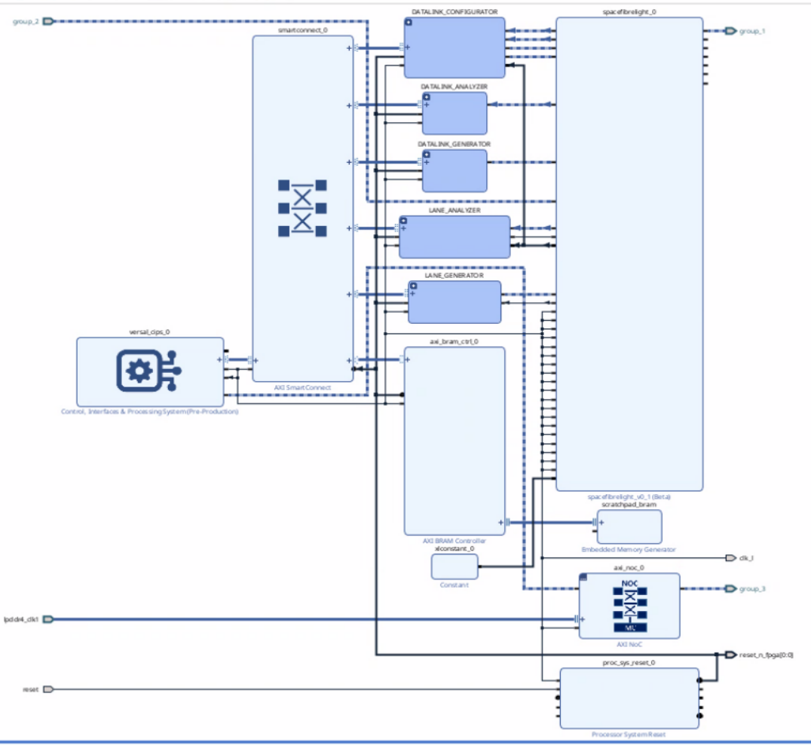

# Setup the Vivado board project
The board is created with `vivado 2024.1`. It targets the xilinx `vek280 evalboard`. For convenience the board parameter is included in `implementation/board/vek280/xilinxboardstore_vek280_2025.1` and sourced automatically during project creation.

Use script `generate_board.sh` to create the vek280 example.
The script uses an environnment variable `SPWF_ROOTPATH` to define the main path for the spacefibrelight git project. If not set a default value is applied.
You can customize some parameters in the topmost part of the script.

There are additionnal parameters you can edit at the beginning of the file `implementation/app/traffic_generator/create_project.tcl` 

# Hardware Test bench
This tesbenches environnement is described in document `P24-9771_TD_Testbench_description_SpaceFibreLight_v0.2.pdf`.The document described a testbench using a RiscV processor (Neorv32). for convenience , the embedded softprocessor was replaced by `ARM R5' processor. The architecture (addresses, modules..) remains the same. A scratchpad ram was added at address '0X90000000' for AXI testing purpose.

A blinking led was also implemented using th eFPGA clock and reset and is located at `DS6, LED 0`.

An FPGA reset is also implemented at `SW4`.

{ width=800px align=center}

# setup the software testbench

1. export the project XSA : `File -> Export Hardware -> export  `
2. open vitis classic
3. create a new application project
4. create a new platform for `R5 processor` based on the exported XSA
5. create a hello world template application project
6. test the hello world project creating a debug session and use the USBC jtag/UART cable (it will probably be on TTY/USB1) 115200B-8-N-1 
7. remove the main.c file from the project
8. add sources `implementation/app/validation_pf/sw` inside your project
9. right click on your application project and select `build C/C++ settings`
    1. in `ARM R5 GCC compiler-> Directories` add `sw/header` folder
10. build your project and run it.
    in the terminal you should see the menu. Youcan select your test to be ran.
    