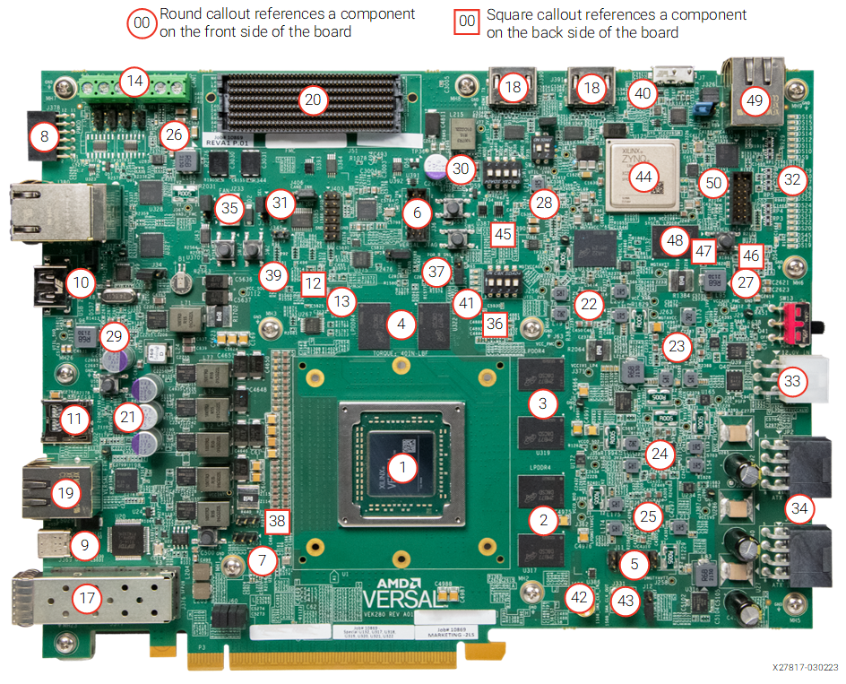

# VEK280
This eval board from xilinx host a Versal Ai-edge device.
The folder `xilinxboardstore_vek280_2025.1` contains the last available xilinx preset for the board. Downloaded from `https://github.com/Xilinx/XilinxBoardStore`
- Documentation for the board is available at : `https://docs.amd.com/r/en-US/ug1612-vek280-eval-bd/Introduction`
- Schematics are available at: `https://www.xilinx.com/products/board-docs/vek280-docs.html`

{ width=800px align=center}

## Setting up the board
In order to run the example device properlly, the board  has to be updated with the latest system controller software. Then a configuration has to be applyed in the system controller web IHM : `BEAM` (for board clock and I/O configuration).

### System controller
System controller is a generic controller board included  in most of the new evalboard from xilinx. It includes:
- A Zynq ultrascale+ MPSOC 
- A dedicated Ethernet link
- A UART (accessible from multiple UART/JTAG to USB link : the one used to configure the eval board)

The Zynq device need several elements prior to be fully functionnal:
1. A binary bitsream for Zynq MPSOC QSPI
2. A Filesystem for its petalinux
3. A board package for the evalboard I/O custom I/O

It allows "easy" configuration of the complex evalboard.
Full documentation is located at : `https://xilinx-wiki.atlassian.net/wiki/spaces/A/pages/2273738753/Versal+Evaluation+Board+-+System+Controller+-+Update+7#Firmware-Updates`

#### System controller full Configuration
The following procedure allows full update of the system controller:
1. Debug booting (https://xilinx-wiki.atlassian.net/wiki/spaces/A/pages/2273738753/Versal+Evaluation+Board+-+System+Controller+-+Update+7#Image-Recovery)
    1. Connect an ethernet cable in [49] from your PC
       connect the usb-c cable in [9] and open the highest numbered port COM with 115200bauds,8N1 in your favorite serial software.
    2. Press button [47] and power on the board (keeping the button pressed)
       The orange led from ethernet connector should light on.
    3. configure your PC to be in ip address 192.168.0.1 (or any any address in this subnet except 192.168.0.111)
    4. Open a browser and go to address http://192.168.0.111 (which is the xilinx board )
2. Upgrade QSPI for system controller (https://xilinx-wiki.atlassian.net/wiki/spaces/A/pages/2273738753/Versal+Evaluation+Board+-+System+Controller+-+Update+7#Image-Recovery)
    1. download the latest binary file for system controller (https://xilinx-wiki.atlassian.net/wiki/spaces/A/pages/2273738753/Versal+Evaluation+Board+-+System+Controller+-+Update+7#Firmware-Updates)
    2. upload it as recover image for `image 1 qspi` and `image b qspi` 
3. Upgrade petalinux (WIC file) stored in EMMC for system controller 
    1. download the latest update (WIC file) for the petalinux distribution: https://www.xilinx.com/member/forms/download/xef.html?filename=system-controller-image-full-cmdline-eval-brd-sc-zynqmp.rootfs-20250524150035_update7.1.wic.xz  and unzip it
    2. still in the recovery browser, select `Image Wic (EMMC)` and upload the `WIC` file 
4.  Board address setup
    1. reboot the board
       you should see petalinux boot stating `petalinux 2024`
       login in using `petalinux user` and set a password 
    2. change it access rights to `/data/` folder using command `sudo chmod 777 /data`
    3. change the ethernet configuration of your system controller using command `sudo system_config.sh`
       I do recommend using adress `192.168.0.111` and disabling DHCP if the system controller is not connected to internet.
    4. reboot the board
    5. ping the board address from you PC with command `ping 192.168.0.111`
    6. connect with ssh to the board with you pc `ssh -l petalinux 192.168.0.111`
3. Set up RAUC (https://xilinx-wiki.atlassian.net/wiki/spaces/A/pages/2273738753/Versal+Evaluation+Board+-+System+Controller+-+Update+7#Upgrading-using-RAUC-CLI)
    1. download latest package RAUC : https://www.xilinx.com/member/forms/download/xef.html?filename=system-controller-rauc-bundle-eval-brd-sc-zynqmp-20250524150035_update7.1.raucb
    2. from a terminal copy the file to the system controller linux filesystem using SCP command : `scp system-controller-rauc-bundle-eval-brd-sc-zynqmp-20250524150035_update7.1.raucb petalinux@192.168.0.111:/data`
    3. in the ssh terminal of your system controller install this RAUC by executing :
    ``` 
    cd /data
    sudo rauc install /data/system-controller-rauc-bundle-eval-brd-sc-zynqmp-20250524150035_update7.1.raucb 
    ```
    you now have to filesystem A and B each one **independant**.
    If at some point your configuration is not working as previously, it probably means you've booted from the other filesystem. Simply do the configuration again (you will probably need to go through an UART terminal)
    4. reboot the board.
4. set the board package : https://xilinx-wiki.atlassian.net/wiki/spaces/A/pages/2273738753/Versal+Evaluation+Board+-+System+Controller+-+Update+7#Installing-Board-Packages
    1. download the offline board package : https://www.xilinx.com/member/forms/download/xef.html?filename=board_packages_eval_brd_sc_zynqmp_05231913_update7.1.tar.gz and unzip it on you PC in folder `board_package`
    2. upload it to the eval board with SCP command : `scp -r board_packages petalinux@192.168.0.111:/data`
    3. log in you eval board from you pc with ssh `ssh -l petalinux 192.168.0.111`
    4. install board package with command (be patient it takes time):
    ```
    cd /data/board_packages
    sudo ./setup_board.sh 
    ```  
    4. Reboot
    5. Open a browser and go to address http://192.168.0.111 (which is the xilinx board )

If it website is not wworking:
1. check board DHCP configuration using serial terminal (see 2.5) (this can be tested with a `ping command`)
2. you probably ended in the second filesystem, reinstall board package in this one (see 4)  

### BEAM
now you can configure the board using the `BEAM` interface. For this project we will be using SFP connector HSSL @100MHz with loopback module:
- set up the GTY clock:
    1. click on `test the board`
    2. click on `board settings`
    3. you can click on get all clock and see the `GTCLK1_OUT8` is not at 100MHz.
    4. Select `Set Boot Clock` (for a persistent parameter) and configure `GTCLK1_OUT8` to 100MHz
    4. Read again the clocks value and confirm the 100MHz frequency
- Enable the `SFP loopback module`
    1. on the left side of `board settings` choose `GPIO Expander`
    2. click `Get all` 
       you'll see at the bottom that `Port 0(3) - SFP_TX_DISABLE (AL): 1`	
    3. select `Set GPIO Expander` 
    4. on `output field` write `0` and click set.
       you'll see that the loopback module switch to green . You can read again all GPIO expander value to confirm it.